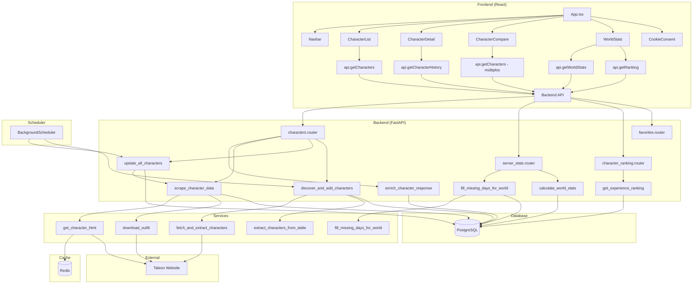
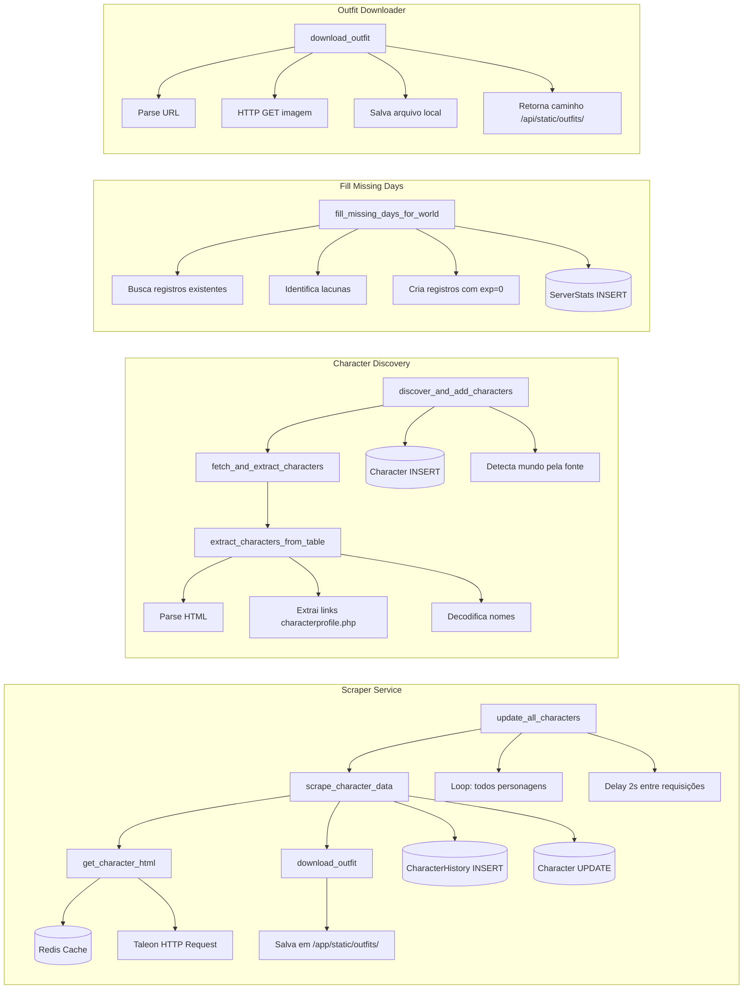
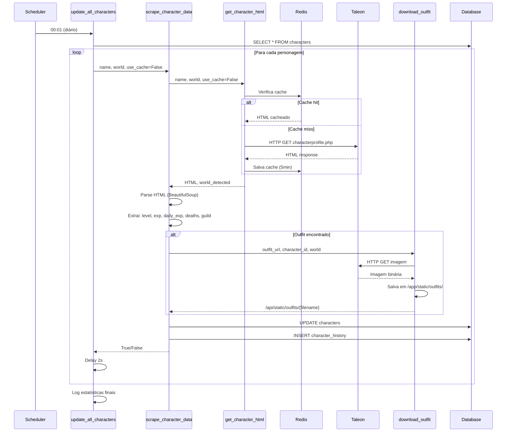
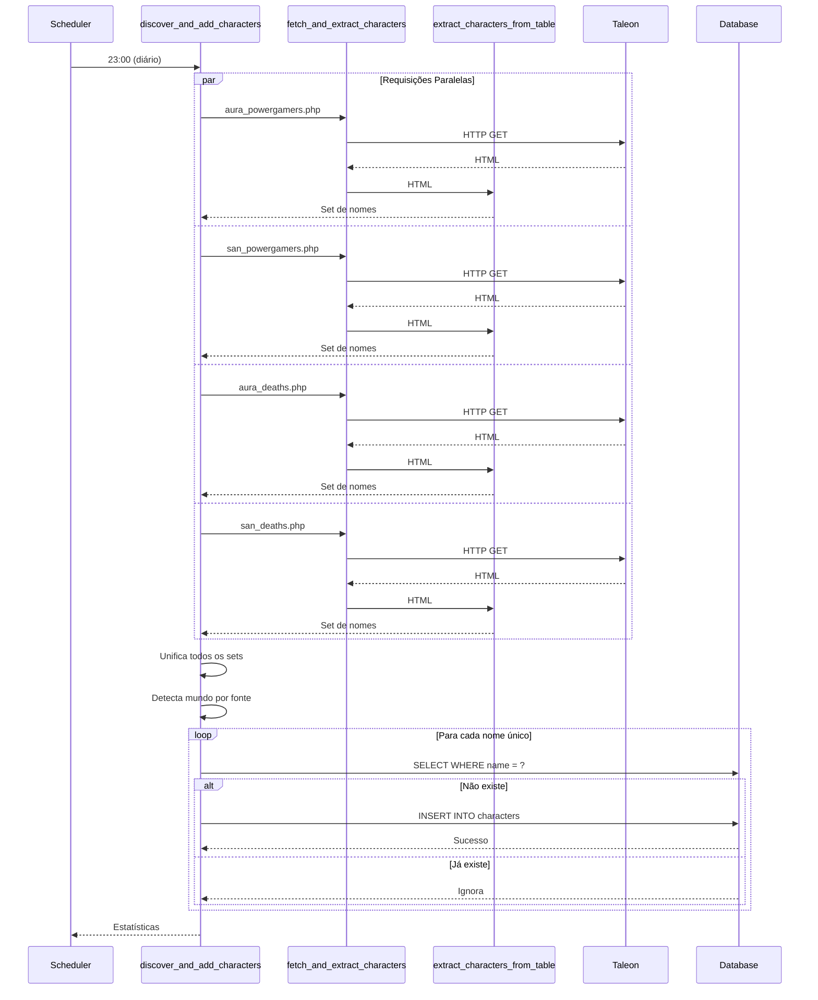
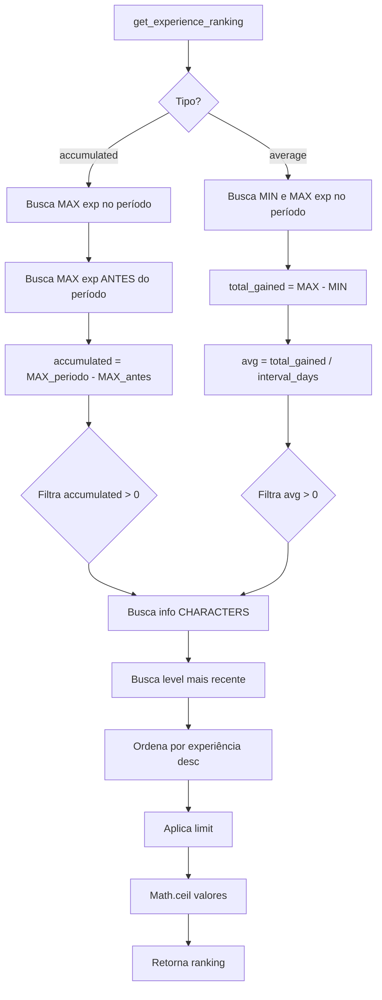
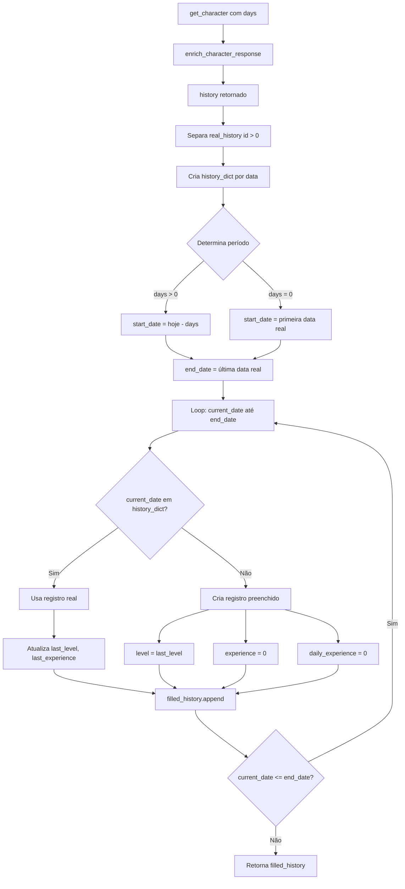
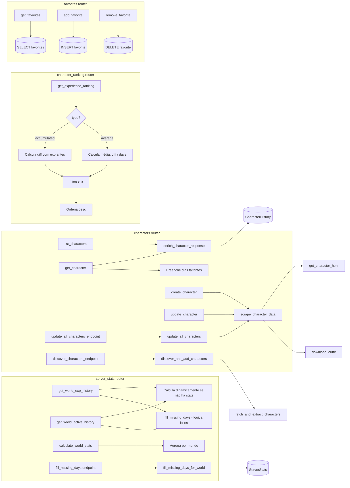
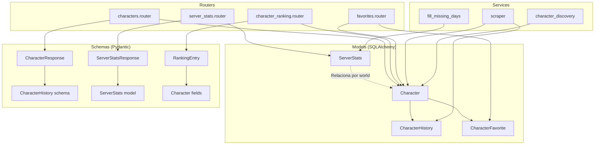

# 🔗 Grafo de Relacionamentos entre Funções - TaleonTracker

Este documento apresenta os grafos de relacionamento entre todas as funções da aplicação, mostrando como elas se conectam e interagem.

## 📊 Formato dos Grafos

Os grafos estão em formato **Mermaid**, que pode ser visualizado em:
- GitHub (renderiza automaticamente)
- Editores como VS Code (com extensão Mermaid)
- Ferramentas online: https://mermaid.live

---

## 🎯 Grafo Principal - Visão Geral do Sistema



---

## 🔄 Grafo Detalhado - Backend Services



---

## 🎨 Grafo Detalhado - Frontend Components

```mermaid
graph TB
    subgraph "App.tsx - Router Principal"
        A[App] --> B[BrowserRouter]
        B --> C[Routes]
        C --> D[/characters]
        C --> E[/characters/:id]
        C --> F[/characters/compare]
        C --> G[/stats]
    end
    
    subgraph "CharacterList.tsx"
        D --> H[CharacterList]
        H --> I[useState: characters, filters]
        H --> J[useEffect: fetchCharacters]
        J --> K[api.getCharacters]
        K --> L[setCharacters]
        H --> M[useMemo: filteredCharacters]
        M --> N[Filtros: nome, mundo, guild, favoritos, EXP dias]
        H --> O[handleToggleFavorite]
        O --> P[api.addFavorite / removeFavorite]
        H --> Q[Grid de Cards]
    end
    
    subgraph "CharacterDetail.tsx"
        E --> R[CharacterDetail]
        R --> S[useParams: id]
        R --> T[useState: character, daysFilter]
        R --> U[useEffect: fetchCharacter]
        U --> V[api.getCharacterHistory]
        V --> W[setCharacter]
        R --> X[useMemo: history filtrado]
        X --> Y[Calcula averageDailyExp]
        R --> Z[Line Chart - Nível + EXP]
        R --> AA[handleUpdate]
        AA --> AB[api.updateCharacter]
    end
    
    subgraph "CharacterCompare.tsx"
        F --> AC[CharacterCompare]
        AC --> AD[useState: selectedCharacters]
        AC --> AE[api.getCharacters - múltiplos]
        AC --> AF[Compara stats lado a lado]
        AC --> AG[Line Chart comparativo]
    end
    
    subgraph "WorldStats.tsx"
        G --> AH[WorldStats]
        AH --> AI[useState: worlds, selectedWorld, stats]
        AH --> AJ[useEffect: fetchWorlds]
        AJ --> AK[api.getWorlds]
        AH --> AL[useEffect: fetchStats]
        AL --> AM[api.getExpHistory]
        AL --> AN[api.getActiveHistory]
        AH --> AO[useEffect: fetchRanking]
        AO --> AP[api.getRanking]
        AH --> AQ[Line Chart: EXP Total]
        AH --> AR[Line Chart: Personagens Ativos]
        AH --> AS[Table + Bar Chart: Ranking]
    end
    
    subgraph "API Service"
        K --> AT[api.ts]
        V --> AT
        AE --> AT
        AK --> AT
        AM --> AT
        AN --> AT
        AP --> AT
        P --> AT
        AB --> AT
        
        AT --> AU[axios.create baseURL: /api]
        AU --> AV[HTTP Requests]
    end
```

---

## 🔀 Grafo de Fluxo de Dados - Scraping



---

## 🔀 Grafo de Fluxo de Dados - Descoberta de Personagens



---

## 🔀 Grafo de Fluxo - Enriquecimento de Resposta

```mermaid
graph TD
    A[get_character endpoint] --> B[Busca Character com history]
    B --> C{Filtra por days?}
    C -->|days > 0| D[Filtra history por cutoff_date]
    C -->|days = 0| E[Usa todo history]
    D --> F[enrich_character_response]
    E --> F
    
    F --> G[Ordena history por timestamp desc]
    G --> H[Separa registros reais id > 0]
    H --> I[latest_history = real_history[0]]
    H --> J[previous_history = real_history[1]]
    
    I --> K{Calcula daily_experience}
    K -->|2+ registros reais| L[diff = latest.exp - previous.exp]
    K -->|1 registro real| M[usa latest.daily_experience]
    K -->|0 registros| N[daily_experience = 0]
    
    L --> O[Monta response]
    M --> O
    N --> O
    
    O --> P{Preenche dias faltantes?}
    P -->|Sim| Q[Separa real vs preenchido]
    Q --> R[Determina período]
    R --> S[Loop: cada dia no período]
    S --> T{Existe registro real?}
    T -->|Sim| U[Usa registro real]
    T -->|Não| V[Cria com exp=0, level=last]
    U --> W[filled_history]
    V --> W
    W --> X[Retorna response]
    P -->|Não| X
```

---

## 🔀 Grafo de Fluxo - Cálculo de Ranking



---

## 🔀 Grafo de Fluxo - Preenchimento de Dias Faltantes



---

## 🔀 Grafo de Dependências - Backend Routers



---

## 🔀 Grafo de Dependências - Frontend Services

```mermaid
graph TD
    subgraph "api.ts - API Service"
        A[getCharacters] --> B[axios.get /characters]
        C[getCharacterHistory] --> D[axios.get /characters/:id?days=]
        E[addCharacter] --> F[axios.post /characters]
        G[updateCharacter] --> H[axios.post /characters/:id/update]
        I[deleteCharacter] --> J[axios.delete /characters/:id]
        K[addFavorite] --> L[axios.post /favorites/:id]
        M[removeFavorite] --> N[axios.delete /favorites/:id]
        O[getFavorites] --> P[axios.get /favorites]
    end
    
    subgraph "format.ts - Utils"
        Q[formatNumber] --> R[Intl.NumberFormat pt-BR]
        S[formatDate] --> T[Date.toLocaleString pt-BR]
        U[getOutfitUrl] --> V[Normaliza caminhos de outfit]
    end
    
    subgraph "Pages"
        W[CharacterList] --> A
        W --> K
        W --> M
        W --> O
        W --> Q
        W --> S
        W --> U
        
        X[CharacterDetail] --> C
        X --> G
        X --> Q
        X --> S
        X --> U
        
        Y[CharacterCompare] --> A
        Y --> Q
        Y --> S
        Y --> U
        
        Z[WorldStats] --> AA[api.getWorlds]
        Z --> AB[api.getExpHistory]
        Z --> AC[api.getActiveHistory]
        Z --> AD[api.getRanking]
    end
```



---

## 🔀 Grafo de Ciclo de Vida - Componentes React

```mermaid
graph TD
    subgraph "CharacterList"
        A[Component Mount] --> B[useEffect: fetchCharacters]
        B --> C[api.getCharacters]
        C --> D[setCharacters]
        D --> E[useEffect: fetchFavorites]
        E --> F[api.getFavorites]
        F --> G[setFavorites]
        
        H[User digita busca] --> I[setSearchTerm]
        I --> J[useMemo: filteredCharacters]
        
        K[User seleciona filtro] --> L[setWorldFilter / setGuildFilter]
        L --> J
        
        M[User marca favorito] --> N[handleToggleFavorite]
        N --> O[api.addFavorite / removeFavorite]
        O --> P[setFavorites]
        P --> J
        
        J --> Q[Render Grid de Cards]
    end
    
    subgraph "CharacterDetail"
        R[Component Mount] --> S[useEffect: fetchCharacter]
        S --> T[api.getCharacterHistory]
        T --> U[setCharacter]
        
        V[User muda daysFilter] --> W[setDaysFilter]
        W --> S
        
        X[User clica Atualizar] --> Y[handleUpdate]
        Y --> Z[api.updateCharacter]
        Z --> S
        
        U --> AA[useMemo: history filtrado]
        AA --> AB[Calcula averageDailyExp]
        AB --> AC[Render Gráfico]
    end
    
    subgraph "WorldStats"
        AD[Component Mount] --> AE[useEffect: fetchWorlds]
        AE --> AF[api.getWorlds]
        AF --> AG[setWorlds]
        AG --> AH[setSelectedWorld primeiro]
        
        AH --> AI[useEffect: fetchStats]
        AI --> AJ[api.getExpHistory]
        AI --> AK[api.getActiveHistory]
        AJ --> AL[setExpHistory]
        AK --> AM[setActiveHistory]
        
        AN[User muda selectedWorld] --> AO[setSelectedWorld]
        AO --> AI
        
        AP[User muda daysFilter] --> AQ[setDaysFilter]
        AQ --> AI
        
        AR[useEffect: fetchRanking] --> AS[api.getRanking]
        AS --> AT[setRanking]
        
        AU[User muda rankingType] --> AV[setRankingType]
        AV --> AR
        
        AW[User muda rankingDays] --> AX[setRankingDays]
        AX --> AR
    end
```



---

## 🔀 Grafo de Relacionamento - Scheduler e Background Tasks

```mermaid
graph TB
    subgraph "Startup (main.py)"
        A[app.on_event startup] --> B[Inicializa Redis Cache]
        A --> C[Inicializa BackgroundScheduler]
        C --> D[schedule_daily_scrape]
        C --> E[schedule_character_discovery]
        C --> F[scheduler.start]
    end
    
    subgraph "Daily Scrape (00:01)"
        D --> G[Cron: hour=0, minute=1]
        G --> H[update_all_characters]
        H --> I[Loop personagens]
        I --> J[scrape_character_data]
        J --> K[(Database)]
    end
    
    subgraph "Character Discovery (23:00)"
        E --> L[Cron: hour=23, minute=0]
        L --> M[run_discovery wrapper]
        M --> N[discover_and_add_characters]
        N --> O[fetch_and_extract_characters - 4x paralelo]
        O --> P[(Database)]
    end
    
    subgraph "Manual Triggers"
        Q[POST /characters/update-all] --> H
        R[POST /characters/discover] --> N
        S[POST /stats/worlds/{world}/fill-missing-days] --> T[fill_missing_days_for_world]
        T --> U[(ServerStats)]
    end
```

---

## 🔀 Grafo de Dependências - Modelos e Schemas



---

## 📈 Legenda dos Grafos

### Tipos de Relacionamento

- **→** : Chamada de função / dependência direta
- **-->>** : Retorno de valor / resposta
- **-.->** : Relacionamento lógico (não direto)
- **{ }** : Condição / decisão
- **[ ]** : Função / componente
- **( )** : Banco de dados / armazenamento

### Cores e Agrupamentos

- **Azul**: Frontend (React)
- **Verde**: Backend (FastAPI)
- **Amarelo**: Services
- **Roxo**: Database
- **Laranja**: External (Taleon)

---

## 🔍 Análise de Dependências

### Funções Core (Mais Importantes)

1. **`scrape_character_data`**: 
   - Chamada por: `update_all_characters`, `create_character`, `update_character`
   - Chama: `get_character_html`, `download_outfit`
   - Impacto: Alto (fonte principal de dados)

2. **`enrich_character_response`**:
   - Chamada por: Todos os endpoints de personagens
   - Chama: Nenhuma (apenas processa dados)
   - Impacto: Alto (formata todas as respostas)

3. **`discover_and_add_characters`**:
   - Chamada por: Scheduler, endpoint manual
   - Chama: `fetch_and_extract_characters`
   - Impacto: Médio (expande base de dados)

4. **`get_experience_ranking`**:
   - Chamada por: Frontend WorldStats
   - Chama: Queries complexas no banco
   - Impacto: Médio (análise de dados)

### Funções de Suporte

- **`get_character_html`**: Cache, requisições HTTP
- **`download_outfit`**: Download e salvamento de imagens
- **`fill_missing_days_for_world`**: Preenchimento de lacunas
- **`extract_characters_from_table`**: Parse de HTML para nomes

---

## 📝 Notas sobre os Grafos

1. **Fluxos Assíncronos**: Muitas funções são `async` e usam `await`
2. **Cache**: `get_character_html` usa Redis para evitar requisições duplicadas
3. **Error Handling**: Todas as funções têm tratamento de erro e logging
4. **Timeouts**: Requisições HTTP têm timeouts configurados
5. **Validação**: Dados são validados antes de persistir no banco

---

## 🎯 Conclusão

Os grafos mostram que a aplicação tem uma arquitetura bem estruturada com:

- **Separação clara** entre frontend e backend
- **Services reutilizáveis** (scraper, discovery, fill_missing_days)
- **Routers organizados** por funcionalidade
- **Dependências bem definidas** (não há dependências circulares)
- **Processamento assíncrono** para operações I/O
- **Cache estratégico** para otimização

Todas as funções trabalham em conjunto para fornecer uma experiência completa de monitoramento e análise de personagens.

